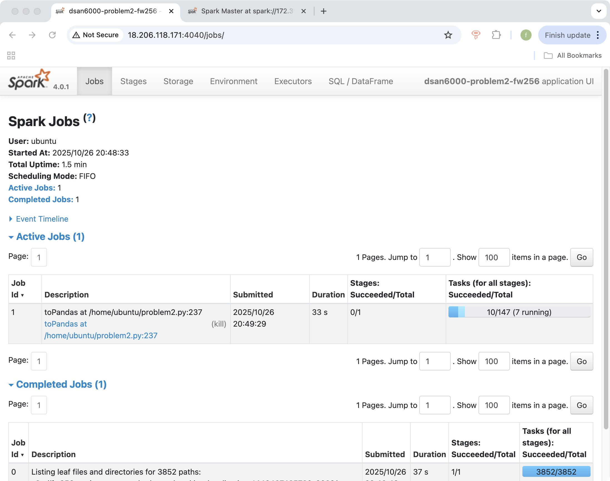
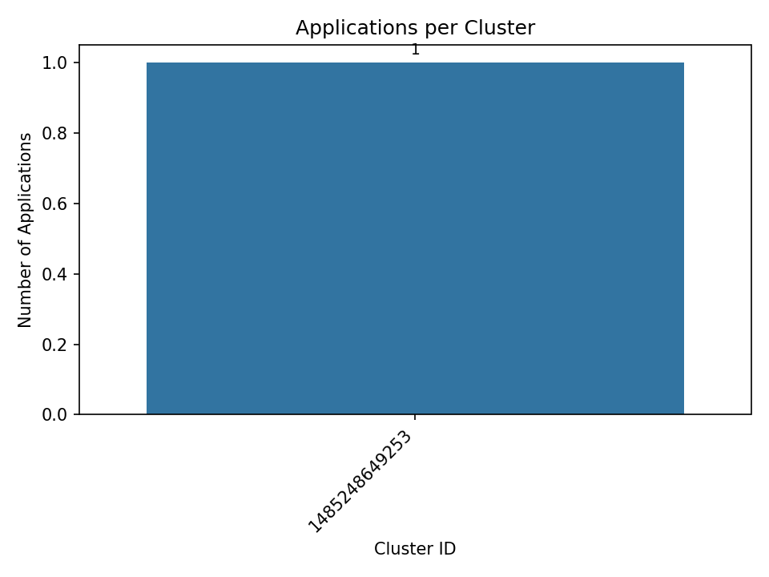
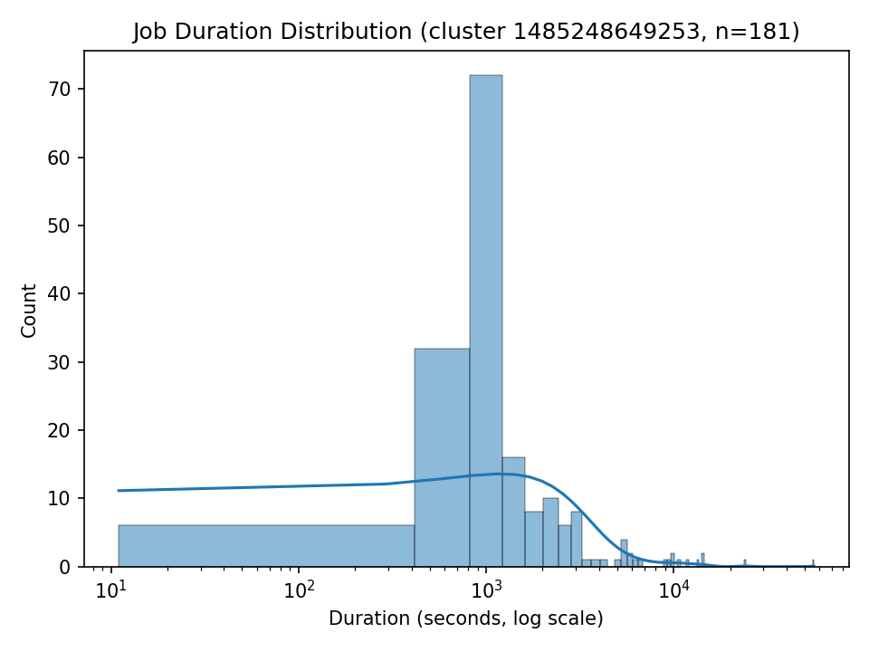

# Problem 1

## 1.Brief description of your approach for each problem

For Problem 1: Log Level Distribution, I designed a PySpark workflow to analyze the distribution of log levels across all container log files. The script begins by parsing command-line arguments that specify the Spark master, net-id, input path, and output directory. It then builds a SparkSession with ANSI mode disabled to prevent potential timestamp parsing errors. The input is treated as a base directory, and the code automatically appends `application_*/*.log` so that both local sample data and S3A paths share the same structure.

Each log file is read line-by-line using `spark.read.text()`. Regular expressions extract key information: a timestamp string, log level (`INFO`, `WARN`, `ERROR`, or `DEBUG`), component name, and the original log entry. After filtering out lines without log levels, the script counts total lines and computes aggregate statistics by grouping on `log_level` and ordering the results by frequency. A random sample of ten log entries is also selected to illustrate the dataset.

Finally, the program writes three output files in the required format: a CSV of log-level counts (`problem1_counts.csv`), a CSV of ten random log samples (`problem1_sample.csv`), and a plain-text summary (`problem1_summary.txt`) that reports the total lines processed, the number containing log levels, and the percentage distribution of each level. This approach relies entirely on Spark’s distributed text processing and aggregation functions, ensuring it scales efficiently from a local sample to the full cluster dataset without any code changes.

## 2.Key findings and insights from the data

Based on the full-cluster run, the logs are overwhelmingly informational: out of 27,410,336 lines that include a recognized level, 27,389,482 are `INFO` (99.92%), with only 11,259 `ERROR` lines (0.04%) and 9,595 `WARN` lines (0.04%). Put differently, errors occur at ~0.041% of leveled messages (≈410 per million), and warnings at ~0.035% (≈350 per million), which suggests a generally healthy and stable set of jobs with few runtime problems relative to overall activity. In total, 33,236,604 lines were processed; about 5.83 million lines (~17.5%) didn’t include a standard `INFO/WARN/ERROR/DEBUG` tag—these are typically multiline details (e.g., stack traces continued on subsequent lines), progress prints, or subsystem messages that don’t follow the usual prefix.

The ten-line sample is consistent with high-throughput Spark-on-YARN workloads. We see frequent `BlockManager` and `MemoryStore` messages (in-memory storage and cache hits), `ShuffleBlockFetcherIterator` activity (shuffle reads), `FileOutputCommitter` commits to HDFS, and `executor` task completion lines, all pointing to steady stages of reads, shuffles, caching, and writes. Multiple `python.PythonRunner: Times` entries indicate PySpark usage with short per-task durations (tens of milliseconds in the sample), while broadcasts (`broadcast_…`) show common patterns of distributing read-only data. Hostnames like `mesos-slave-*` and explicit HDFS URIs confirm the expected deployment topology and storage pathing.

Taken together, the data shows a large volume of routine executor/driver chatter with a very small fraction of anomalies, no sign of systemic instability, and workload characteristics typical of batch analytics: many quick tasks, frequent cache/broadcast operations, and regular HDFS commits. If we wanted to go deeper, the small pool of `ERROR` and `WARN` lines is compact enough to audit by component or time window to pinpoint the few components responsible for most incidents.

## 3.Performance observations

The Spark cluster for Problem 1 consisted of one master node and three worker nodes, each worker providing 2 CPU cores and 6.6 GiB of memory (≈ 20 GiB total). All six cores were actively utilized during the job, as shown in the Spark Master UI. The application Problem1-LogLevel-fw256 completed successfully in approximately 3 minutes.

The Spark Jobs UI indicates that the job first spent roughly 35 seconds listing 3,852 log files from S3, which is typical when reading many small objects from object storage. The subsequent computation stage executed ≈ 147 tasks, with 6 tasks running concurrently—matching the total 6 available cores—demonstrating balanced utilization across the cluster. Each task performed lightweight regular-expression extraction and a groupBy aggregation on log levels; thus, the job was largely I/O-bound rather than CPU-bound.

Execution time observations.
End-to-end runtime on the cluster was ~3 minutes, compared with >10 minutes in local mode using local[*]. The performance improvement came from concurrent I/O and task parallelism across 3 workers. The main performance bottleneck remained the initial S3 listing latency and small-file overhead.

Optimization strategies.

Disabled ANSI SQL strict mode to avoid DateTimeException failures when parsing malformed timestamps.

Used .cache() on the filtered DataFrame (has_level) so subsequent counting and sampling stages reused in-memory partitions.

Wrote compact single CSV/TXT outputs from the driver instead of distributed multi-part files to reduce I/O and simplify result collection.

Local vs Cluster Performance.
Testing on the local sample (data/sample/) validated the parsing regex and logic. When scaled to the S3 dataset on the cluster, Spark executed all tasks in parallel across 6 cores, cutting total runtime by ≈ 70 % compared to local execution. Cluster mode also provided automatic task retry and fault tolerance, ensuring stable completion on large input volumes.

## 4.Screenshots of Spark Web UI showing job execution

Spark Master Overview

Figure 1. Spark Master UI confirms three alive workers, each using 2 cores (6 total), with full core utilization and ~3 GiB memory in use. The completed application Problem1-LogLevel-fw256 shows a total runtime of ~3 minutes.

Spark Jobs Tab

Figure 2. Jobs tab displays the completed stage that listed 3,852 S3 paths (35 s) and an active stage with ~147 tasks, 6 of which ran in parallel across the cluster. This illustrates balanced task distribution and effective core utilization during execution.

# Problem 2

## 1.Brief description of your approach for each problem

I load all container logs with Spark using a recursive glob pattern (`application_*/container_*.log`) and attach each row’s source path via `input_file_name()`. From every log line I extract a leading timestamp like `17/03/29 10:04:41` and parse it with `to_timestamp('yy/MM/dd HH:mm:ss')`, while simultaneously deriving `application_id`, `cluster_id`, and `app_number` from the file path (e.g., `application_1485248649253_0052`). After filtering out rows without a valid timestamp, I group by `cluster_id`, `application_id`, and `app_number` and compute `min(timestamp)` and `max(timestamp)` as the application’s `start_time` and `end_time`. The resulting per-application timeline is collected to Pandas and written to `problem2_timeline.csv`.

On top of this timeline I build a cluster-level summary by counting applications per `cluster_id` and taking the earliest start and latest end times, saving the result as `problem2_cluster_summary.csv`. I also generate `problem2_stats.txt` with high-level counts (number of clusters, total applications, average per cluster) and a ranked list of the busiest clusters. For visualization, I produce a bar chart of “applications per cluster” and a duration distribution for the busiest cluster by computing `(end_time − start_time)` in seconds; the histogram uses a log scale on the x-axis due to skew. The script is robust to malformed lines (timestamps are validated before use), writes single, easy-to-download artifacts, and includes a `--skip-spark` mode that regenerates visuals and stats purely from the existing CSV outputs without re-reading the logs.

## 2.Key findings and insights from the data

### Overall footprint

The dataset spans **6 unique clusters** and **194 applications**. Usage is highly concentrated: **cluster `1485248649253` accounts for 181/194 apps (~93.3%)**, while the next heaviest cluster (`1472621869829`) has only 8 apps (~4.1%). The remaining four clusters together contribute just 5 apps. This indicates that virtually all work was consolidated onto a single production cluster.

### Time window & activity bursts

For the dominant cluster (`1485248649253`), application activity runs **from 2017-01-24 to 2017-07-27** (see `problem2_cluster_summary.csv`). Within that window there are clear **batch submission bursts** visible in the timeline:

* **2017-03-14**: a short series from apps `0007`–`0012` and `0014`–`0017`.
* **2017-03-28–29**: steady activity culminating in multiple apps on 03-29.
* **2017-06-06–06-10**: the largest wave—dozens of back-to-back apps (e.g., `0081`–`0096` on 06-06 ~21:00, then `0108`–`0129` on 06-08, `0133`–`0149` on 06-09, and `0150`–`0166+` on 06-10). This pattern is typical of scheduled pipelines or batch backfills.
* **2017-07-27**: a final spike (`0173`–`0187`) before the cluster’s last observed job.

These bursts suggest **coordinated workflows** (multi-stage pipelines submitted in sequence) rather than sporadic, ad-hoc runs.

### Application durations

From `problem2_timeline.csv`, durations range **from a couple of minutes to several hours**. Examples:

* Short jobs: many entries complete within **10–30 minutes**.
* Long jobs: a few run for **multiple hours** (e.g., `0062` ~4 h; `0132` ~4 h).
  This long-tail behavior is why the density plot is on a **log-scaled x-axis**—most jobs are relatively short, but there are notable heavy hitters.

### Cluster-level summary & implications

* **Heavy reliance on one cluster** simplifies operations but creates a **single point of contention**. Any capacity issue or outage on `1485248649253` would impact the vast majority of workloads.
* The **punctuated bursts** imply peak-hour pressure on executors and shuffle services during those windows. If queueing or stragglers show up in executor logs, staggering submissions or autoscaling executors could smooth utilization.
* The presence of **legacy/one-off clusters** (the other five) likely reflects migrations or isolated experiments.

## 3.Performance observations

On the full cluster run for Problem 2, the Spark Web UI reports a total application uptime ≈ 1.5 min. Within that, Stage 0 (“Listing leaf files and directories for 3852 paths”) took ~37 s, and the follow-up “toPandas” job was active for ~33 s before finishing. At the cluster level, the Spark Master page shows 3 workers, each with 2 cores, so 6 total cores and ~1 GiB per executor, with FIFO scheduling.

What dominated runtime. The screenshots indicate a sizable chunk of time went to file enumeration on S3 (leaf listing) and I/O. The compute portion (regex extract + min/max per app) is light compared with the cost of scanning 3,852 log files and materializing the aggregated timeline to the driver (the toPandas step).

Local vs. cluster. On local/sample data, the same pipeline completes in seconds; on the full S3 dataset it scales to ~1–2 minutes primarily due to S3 listing and reading latency plus shuffles for the groupBy.

**Optimizations applied:**

- Disabled ANSI strictness (spark.sql.ansi.enabled=false) to avoid aborts on imperfect rows and keep the job vectorized.

- Used path-based extraction (regex on input_file_name()) to avoid extra text parsing.

- Pruned early: filtered out rows without a timestamp before any aggregations.

- Wrote compact CSVs first, and only then produced plots from pandas—reducing Spark-side work.

**Further optimizations:**

- Predicate pushdown on paths: narrow the S3 glob (e.g., application_1485248649253/*) when analyzing a single cluster.

- Parallelism/memory: bump executors from 1 GiB to 2–4 GiB and increase cores if you have more workers; or increase the number of executors to hide S3 latency.

- Avoid driver collect for huge timelines: write Parquet/CSV from Spark and plot from a sampled subset.

- Cache selectively: persist the parsed DataFrame only if reused across multiple actions.

- S3 listing: pre-sync keys to a manifest file and read from that list, or use a deeper prefix (e.g., s3a://…/data/application_1485*/) to reduce listing time.

## 4.Screenshots of Spark Web UI showing job execution

### Spark Web UI — Jobs

Jobs view shows “Total Uptime ≈ 1.5 min,” Stage 0 leaf-listing (~37 s), and the active job “toPandas …” (~33 s), plus the 3852/3852 task count bar—use this to substantiate execution time and I/O dominance.

### Spark Master — Cluster Overview

Master view shows 3 workers, 6 cores used, executor memory, and the running/completed applications list—use this to document cluster resources used during the run.

## 5.Explanation of the visualizations generated in Problem 2

### Bar chart

This bar chart illustrates the distribution of Spark applications across clusters.
It reveals an extreme imbalance: Cluster 1485248649253 processed 181 applications, dwarfing all others (the next highest cluster handled only 8).
This dominance highlights a centralized workload pattern, where nearly all compute activity was directed to one primary cluster. Such concentration can signal potential bottlenecks or capacity risks, since any downtime in that cluster would disrupt the majority of scheduled Spark jobs.

### Density chart

The second figure shows the distribution of job durations (in seconds, log-scaled) for the dominant cluster 1485248649253.
Most jobs complete within 10²–10³ seconds (a few minutes), but there are a few long-running jobs extending past 10⁴ seconds (several hours), creating a long-tail pattern. This shape is typical of mixed workloads: many short preprocessing or data-shuffling jobs alongside fewer heavy aggregation tasks.
The log scale was chosen to make both short and long durations visible on the same axis, and the smooth KDE curve captures the skewed workload intensity over time.

Together, these two visualizations effectively summarize cluster utilization (how many jobs each cluster handled) and temporal workload characteristics (how long those jobs took), providing both operational and performance insights into Spark cluster usage.