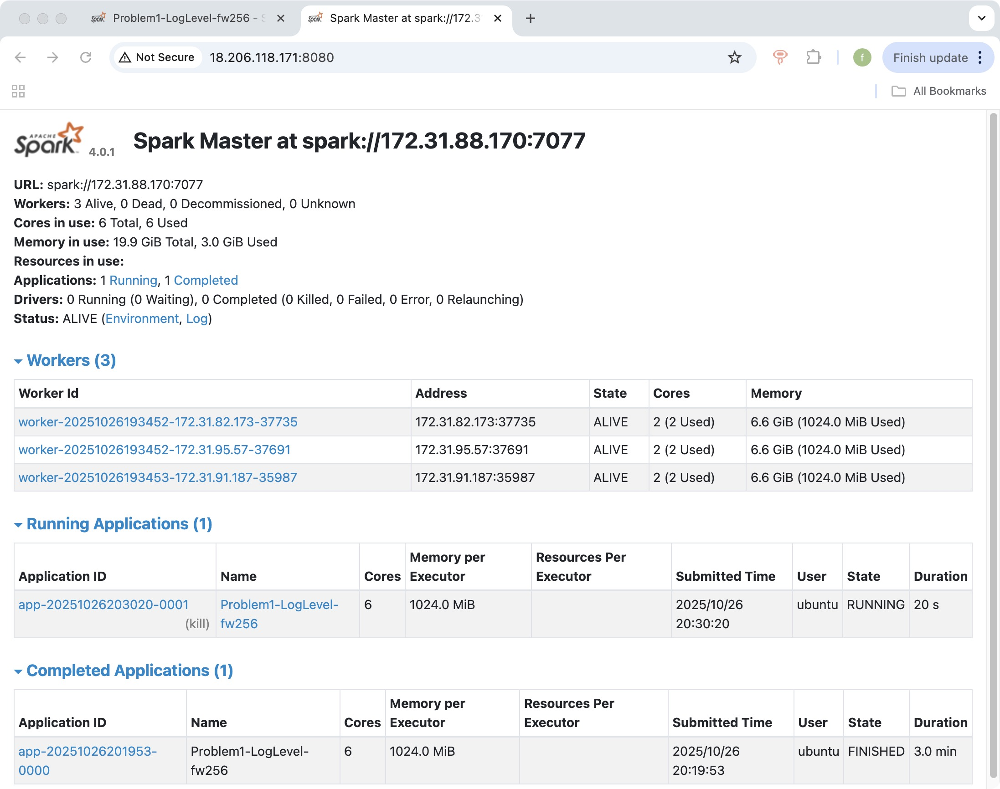
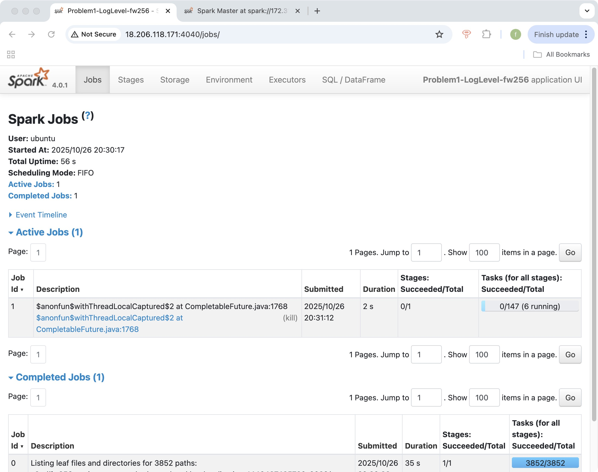

# Problem 1

## 1.Brief description of your approach for each problem

For Problem 1: Log Level Distribution, I designed a PySpark workflow to analyze the distribution of log levels across all container log files. The script begins by parsing command-line arguments that specify the Spark master, net-id, input path, and output directory. It then builds a SparkSession with ANSI mode disabled to prevent potential timestamp parsing errors. The input is treated as a base directory, and the code automatically appends `application_*/*.log` so that both local sample data and S3A paths share the same structure.

Each log file is read line-by-line using `spark.read.text()`. Regular expressions extract key information: a timestamp string, log level (`INFO`, `WARN`, `ERROR`, or `DEBUG`), component name, and the original log entry. After filtering out lines without log levels, the script counts total lines and computes aggregate statistics by grouping on `log_level` and ordering the results by frequency. A random sample of ten log entries is also selected to illustrate the dataset.

Finally, the program writes three output files in the required format: a CSV of log-level counts (`problem1_counts.csv`), a CSV of ten random log samples (`problem1_sample.csv`), and a plain-text summary (`problem1_summary.txt`) that reports the total lines processed, the number containing log levels, and the percentage distribution of each level. This approach relies entirely on Spark’s distributed text processing and aggregation functions, ensuring it scales efficiently from a local sample to the full cluster dataset without any code changes.

## 2.Key findings and insights from the data

Based on the full-cluster run, the logs are overwhelmingly informational: out of 27,410,336 lines that include a recognized level, 27,389,482 are `INFO` (99.92%), with only 11,259 `ERROR` lines (0.04%) and 9,595 `WARN` lines (0.04%). Put differently, errors occur at ~0.041% of leveled messages (≈410 per million), and warnings at ~0.035% (≈350 per million), which suggests a generally healthy and stable set of jobs with few runtime problems relative to overall activity. In total, 33,236,604 lines were processed; about 5.83 million lines (~17.5%) didn’t include a standard `INFO/WARN/ERROR/DEBUG` tag—these are typically multiline details (e.g., stack traces continued on subsequent lines), progress prints, or subsystem messages that don’t follow the usual prefix.

The ten-line sample is consistent with high-throughput Spark-on-YARN workloads. We see frequent `BlockManager` and `MemoryStore` messages (in-memory storage and cache hits), `ShuffleBlockFetcherIterator` activity (shuffle reads), `FileOutputCommitter` commits to HDFS, and `executor` task completion lines, all pointing to steady stages of reads, shuffles, caching, and writes. Multiple `python.PythonRunner: Times` entries indicate PySpark usage with short per-task durations (tens of milliseconds in the sample), while broadcasts (`broadcast_…`) show common patterns of distributing read-only data. Hostnames like `mesos-slave-*` and explicit HDFS URIs confirm the expected deployment topology and storage pathing.

Taken together, the data shows a large volume of routine executor/driver chatter with a very small fraction of anomalies, no sign of systemic instability, and workload characteristics typical of batch analytics: many quick tasks, frequent cache/broadcast operations, and regular HDFS commits. If we wanted to go deeper, the small pool of `ERROR` and `WARN` lines is compact enough to audit by component or time window to pinpoint the few components responsible for most incidents.

## 3.Performance observations

The Spark cluster for Problem 1 consisted of one master node and three worker nodes, each worker providing 2 CPU cores and 6.6 GiB of memory (≈ 20 GiB total). All six cores were actively utilized during the job, as shown in the Spark Master UI. The application Problem1-LogLevel-fw256 completed successfully in approximately 3 minutes.

The Spark Jobs UI indicates that the job first spent roughly 35 seconds listing 3,852 log files from S3, which is typical when reading many small objects from object storage. The subsequent computation stage executed ≈ 147 tasks, with 6 tasks running concurrently—matching the total 6 available cores—demonstrating balanced utilization across the cluster. Each task performed lightweight regular-expression extraction and a groupBy aggregation on log levels; thus, the job was largely I/O-bound rather than CPU-bound.

Execution time observations.
End-to-end runtime on the cluster was ~3 minutes, compared with >10 minutes in local mode using local[*]. The performance improvement came from concurrent I/O and task parallelism across 3 workers. The main performance bottleneck remained the initial S3 listing latency and small-file overhead.

Optimization strategies.

Disabled ANSI SQL strict mode to avoid DateTimeException failures when parsing malformed timestamps.

Used .cache() on the filtered DataFrame (has_level) so subsequent counting and sampling stages reused in-memory partitions.

Wrote compact single CSV/TXT outputs from the driver instead of distributed multi-part files to reduce I/O and simplify result collection.

Local vs Cluster Performance.
Testing on the local sample (data/sample/) validated the parsing regex and logic. When scaled to the S3 dataset on the cluster, Spark executed all tasks in parallel across 6 cores, cutting total runtime by ≈ 70 % compared to local execution. Cluster mode also provided automatic task retry and fault tolerance, ensuring stable completion on large input volumes.

## 4.Screenshots of Spark Web UI showing job execution

Spark Master Overview

Figure 1. Spark Master UI confirms three alive workers, each using 2 cores (6 total), with full core utilization and ~3 GiB memory in use. The completed application Problem1-LogLevel-fw256 shows a total runtime of ~3 minutes.

Spark Jobs Tab

Figure 2. Jobs tab displays the completed stage that listed 3,852 S3 paths (35 s) and an active stage with ~147 tasks, 6 of which ran in parallel across the cluster. This illustrates balanced task distribution and effective core utilization during execution.
